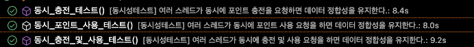

# 동시성 제어 방식에 대한 분석 및 보고서

## 개요
해당 보고서는 동시선 문제를 해결하기 위해 설계된 포인트 관리 서비스의 동시성 제어 방식과 이를 검증하기 위한 테스트 시나리오를 다루고 있습니다. 주요 목표는 아래와 같습니다.
- 여러 thread가 동시에 요청할 때 데이터 정합성을 보장
- 충전 및 사용 요청 간의 `경쟁상태(race condition)`를 방지
- 높은 확장성과 성능을 유지하면 문제 해결

## 동시성 문제 정의

### 1. 초과 사용 문제
- 여러 스레드가 동시에 사용 요청을 처리할 경우, 잔고를 초과한 포인트가 사용될 수 있습니다.
### 2. 중복 처리 문제
- 충전 요청이 중복 실행되면 데이터가 의도치 않게 변경될 가능성이 있습니다.
### 3. 순차 처리 미보장
- 충전 및 사용 요청이 순차적으로 처리되지 않아 결과의 일관성이 유지되지 않을 수 있습니다.

## 동시성 제어 설계

### 1. 사용자별 ReetrantLock 활용
- 구현: 사용자별 고유한 ReetrantLock을 관리하는 LockRegistry를 설계하여 사용자 단위로 동시성 제어를 적용
- 작동방식
  - 사용자 요청 시, 해당 사용자 ID에 대한 고유 ReetrantLock을 가져옴
  - 요청 처리 전, `lock.lock()`으로 락을 획득하고, 처리 완료 후 `lock.unlock()`로 해제
```java
@Component
public class LockRegistry {

    private final ConcurrentHashMap<Long, ReetrantLock> lockMap = new ConcurrentHashMap<>();
    public ReetrantLock getLock(long userId) {
        return lockMap.computeIfAbsent(userId, id -> new ReetrantLock());
    }
}
```

### 2. PointServiceImpl 동작방식
포인트 충전과 포인트 사용 모두 동일한 사용자별 락을 통해 동시성 제어를 적용합니다.

1. 포인트 충전
  - 사용자 데이터 조회 후, 충전 금액을 더해 저장
  - 충전 애역을 기록
  - 락 해제
2. 포인트 사용
  - 사용자 데이터를 조회 후, 사용 가능 여부를 검증
  - 사용 금액을 차감한 뒤 저장 및 내역 기록
  - 락 해제
```java
@Override
public UserPoint chargeUserPoint(long userId, long amount) {
    ReentrantLock lock = lockRegistry.getLock(userId);
    lock.lock();
    try {
        UserPoint userPoint = userPointTable.selectById(userId);
        if (userPoint == null) throw new IllegalArgumentException("존재하지 않는 유저입니다.");
        UserPoint updatedUserPoint = userPoint.increaseUserPoints(amount);
        pointHistoryTable.insert(userId, amount, TransactionType.CHARGE, System.currentTimeMillis());
        userPointTable.insertOrUpdate(updatedUserPoint.id(), updatedUserPoint.point());
        return updatedUserPoint;
    } finally {
        lock.unlock();
    }
}
```

## 테스트 전략 및 시나리오

### 테스트 환경
- 환경: JUnit 5, Spring Boot, Mockito
- 멀티스레드 시뮬레이션:
  - ExecutorService와 CountDownLatch를 사용해 다수의 요청을 동시에 실행
  - 예상 결과와 실제 결과를 비교하여 데이터 정합성을 검증
### 테스트 시나리오
1. 포인트 충전 동시 요청
  - 목표: 여러 스레드가 동시에 충전 요청을 실행할 때, 최종 잔고가 충전 요청 합계와 동일
  - 결과: 모든 충전 요청이 순차적으로 처리되어 정합성 유지
  - 테스트 결과(스레드 20개 기준)
    - 소요시간: 8.4초
    - 결과: 성공
```text
[동시성테스트] 여러 스레드가 동시에 충전을 요청하면 데이터 정합성을 유지한다.: 8.4s
```

2. 포인트 사용 동시 요청
  - 목표: 여러 스레드가 동시에 사용 요청을 실행할 때, 사용 가능한 잔고를 초과한 요청은 실패
  - 결과: 초과 요청은 실패하고, 성공 요청만 반영되어 정합성 유지
  - 테스트 결과(스레드 20개 기준)
    - 소요시간: 8.0초
    - 결과: 성공
```text
[동시성테스트] 여러 스레드가 동시에 포인트 사용 요청을 하면 데이터 정합성을 유지한다.: 8.0s
```

3. 충전 및 사용 동시 요청
  - 목표: 전과 사용 요청이 동시에 발생할 때, 최종 결과가 순차 처리된 결과와 동일
  - 결과: 든 요청이 순차 처리된 결과와 동일
  - 테스트 결과(스레드 20개 기준)
    - 소요시간: 9.2초
    - 결과: 성공
```text
[동시성테스트] 여러 스레드가 동시에 충전 및 사용 요청을 하면 데이터 정합성을 유지한다.: 9.2s
```

## 결론

### 동시성 문제 해결
- 사용자별 고유 ReentrantLock을 활용해 충전 및 사용 요청 간 경쟁 상태를 효과적으로 방지
- 모든 테스트 시나리오에서 데이터 정합성을 성공적으로 유지

### 테스트 결과



| 테스트 시나리오(스래드 20개 기준)                     | 소요 시간 | 결과 |
|---------------------------------------|-----------|------|
| 포인트 충전 동시 요청                 | 8.4s      | ✅    |
| 포인트 사용 동시 요청                 | 8.0s      | ✅    |
| 충전 및 사용 동시 요청                | 9.2s      | ✅    |


포인트 충전 및 사용 요청 시 정합성 보장
충전 및 사용이 동시 발생해도 최종 결과가 순차 처리 결과와 동일

### 향후 개선 방향
- 락 해제 누락 방지
  - try-finally 블록을 철저히 적용하여 락 해제 누락 가능성 차단

- 비차단 동시성 제어
  - 높은 트래픽 환경에서 Optimistic Locking을 고려한 비차단 방식으로의 전환 가능성 검토